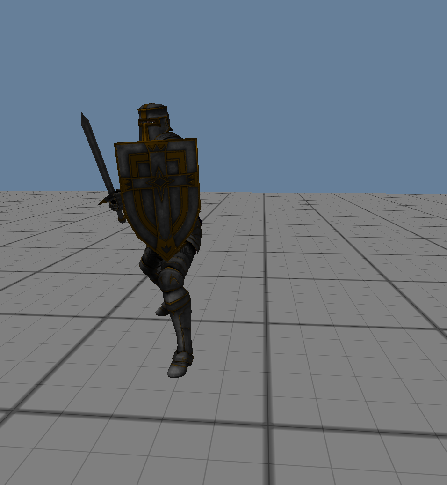

Dent Asset Viewer
=================

A very simple asset viewer.  Applies animations to models with bone structure too.

I'm mostly using this to improve `dent`, which I am using for other projects.  It cuts away all the nonsense so I can focus on the model importer, skinner and animator.

## Formats supported
I've mostly tested this for fbx formats.  However it uses `PyAssimp` as a loader, so should work with any of those as well.

The textures are stored a litle strangely.  If the material is called `mat_name` then the engine looks for `mat_name.diff.png` and `mat_name.norm.png` in the same directory as the model.  Use blender or something to extract embedded textures for your own models.

## Screenshots

This is an image of a [Mixamo](https://www.mixamo.com) "Paladin" model with one of their animations applied.

## Running
Runnning the game should be as simple as
~~~
pip install -r requirements.txt
./viewer <path to asset> --animation <path to animation>
~~~

I'm working on creating standalone executables with Pyinstaller so that dependencies are managed.

## Controls
Mouse and mouse wheel.
